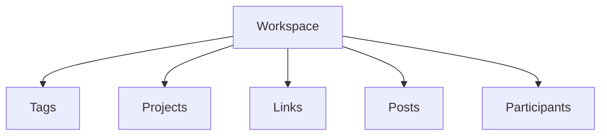
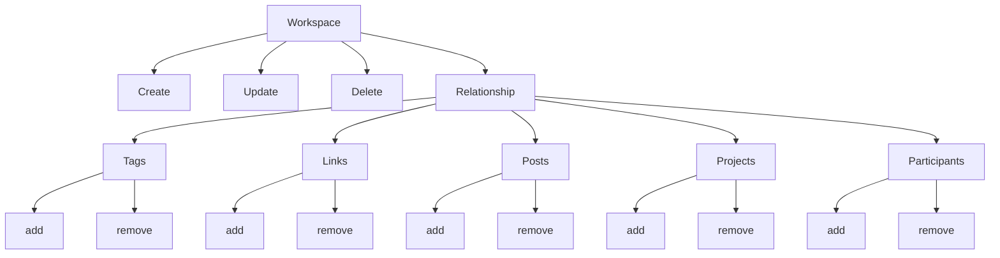

# Workspace Module
## Simple management of the workspaces

```mermaid
graph TD;
    Workspace-->Tags;
    Workspace-->Projects;
    Workspace-->Links;
    Workspace-->Posts;
    Workspace-->Participants;
```
###Workspace Actions

```mermaid
graph TD;
    Workspace-->Create;
    Workspace-->Update;
    Workspace-->Delete;
    Workspace-->Relationship;
    Relationship-->Tags;
    Tags-->TagsAdd[add];
    Tags-->TagsRemove[remove];
    Relationship-->Links;
    Links-->LinkAdd[add];
    Links-->RemoveLink[remove];
    Relationship-->Posts;
    Posts-->AddPost[add];
    Posts-->RemovePost[remove];
    Relationship-->Projects;
    Projects-->AddProject[add];
    Projects-->RemoveProject[remove];
    Relationship-->Participants;
    Participants-->AddParticipant[add];
    Participants-->RemoveParticipant[remove];
    
```
