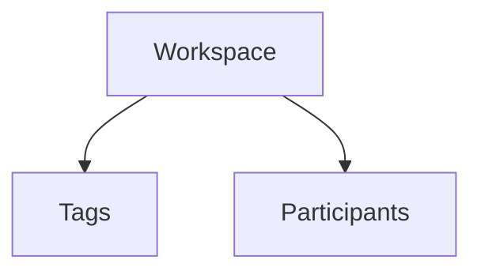
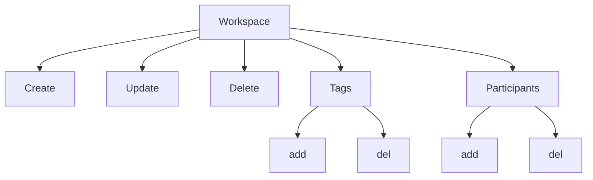

# Workspace Module
### Simple workspace management

### Workspace Actions

### Requisitos
1. **Workspace**
   1. Field validartions
      1. **User**
         1. [x] required
         2. [x] valid user
         3. [ ] Usuário ativo
      2. **Parent**
         1. [ ] workspace válido
      3. **Name** 
         1. [ ] obrigatório
         2. [ ] mínimo de 2 carateres
         3. [ ] máximo de 100 caracteres
         4. [ ] obrigatório
      4. **Description**
         1. [ ] máximo de 200 caracteres
2. **Tags**
   1. **Workspace**
      1. [ ] obrigatório
      2. [ ] válido
   2. **User Owner**
      1. [ ] obrigatório
      2. [ ] valido
      3. [ ] ativo
   3. **Nome**
      1. [ ] obrigatório
      2. [ ] minimo de 1 palavra
      3. [ ] minimo de 3 caracteres
      4. [ ] maximo de 50 caracteres
3. **Participantes**
   1. **Workspace**
      1. [ ] válido
      2. [ ] ativo
      3. [ ] obrigatorio
   2. **Usuário reponsável**
      1. [ ] válido
      2. [ ] ativo
      3. [ ] obrigatório
