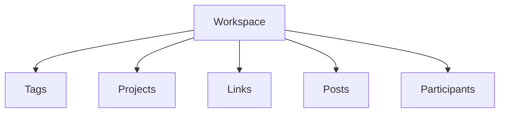
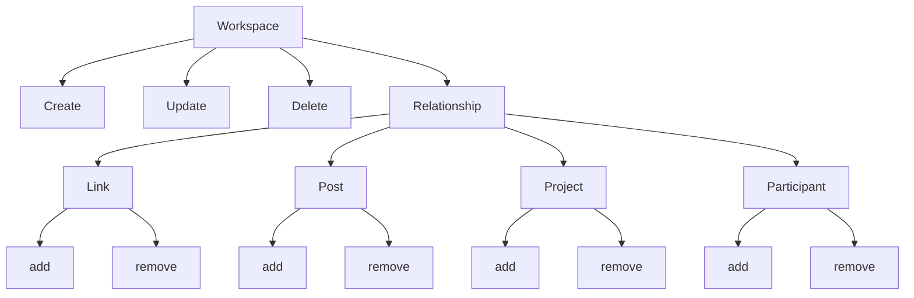

# Workspace Module
## Simple management of the workspaces
### Diagrama geral simplificado

```mermaid
graph TD;
    Workspace-->Tags;
    Workspace-->Projects;
    Workspace-->Links;
    Workspace-->Posts;
    Workspace-->Participants;
```
###Workspace Actions

```mermaid
graph TD;
    Workspace-->Create;
    Workspace-->Update;
    Workspace-->Delete;
    Workspace-->Relationship;
    Relationship-->Link;
    Link-->LinkAdd[add];
    Link-->RemoveLink[remove];
    Relationship-->Post;
    Post-->AddPost[add];
    Post-->RemovePost[remove];
    Relationship-->Project;
    Project-->AddProject[add];
    Project-->RemoveProject[remove];
    Relationship-->Participant;
    Participant-->AddParticipant[add];
    Participant-->RemoveParticipant[remove];
    
```
