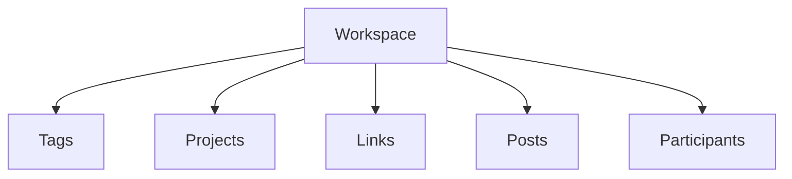
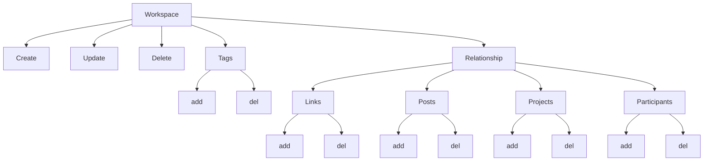

# Workspace Module
## Simple workspace management

```mermaid
graph TD;
    Workspace-->Tags;
    Workspace-->Projects;
    Workspace-->Links;
    Workspace-->Posts;
    Workspace-->Participants;
```
###Workspace Actions

```mermaid
graph TD;
    Workspace-->Create;
    Workspace-->Update;
    Workspace-->Delete;
    Workspace-->Tags;
    Tags-->TagsAdd[add];
    Tags-->TagsDel[del];
    Workspace-->Relationship;
    Relationship-->Links;
    Links-->LinkAdd[add];
    Links-->LinkDel[del];
    Relationship-->Posts;
    Posts-->PostAdd[add];
    Posts-->PostDel[del];
    Relationship-->Projects;
    Projects-->ProjectAdd[add];
    Projects-->ProjectDel[del];
    Relationship-->Participants;
    Participants-->ParticipantAdd[add];
    Participants-->ParticipantDel[del];
    
```
